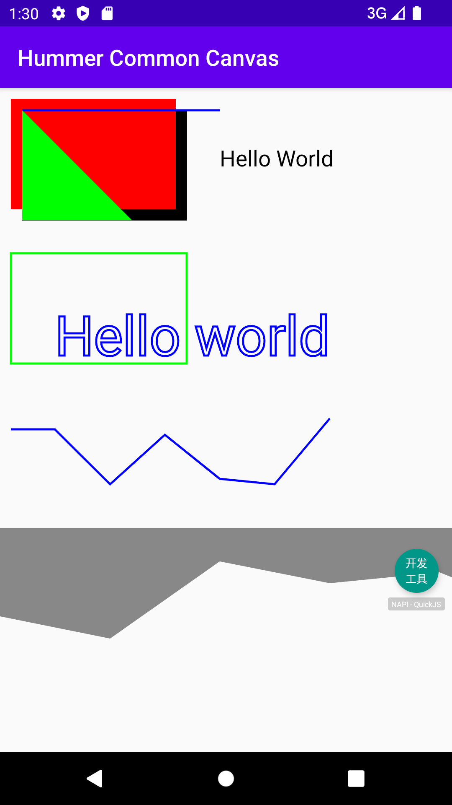

基于 hummer（https://hummer.didi.cn/#/） 跨端框架的通用canvas组件，提供和js canvas一样的api
===

### 使用示例
``` javascript
const canvas = new Canvas();
const ctx = canvas.getContext("2d");

// Draw rect
ctx.rect(20, 20, 150, 100);
ctx.fill();

// Draw text
ctx.fillStyle = "black";
ctx.font = "20px serif"
ctx.fillText("Hello World", 200, 50);

// Draw rect
ctx.fillColor = "red";
ctx.fillRect(10, 10, 150, 100);

// First path
ctx.beginPath();
ctx.lineWidth = 2;
ctx.strokeStyle = "blue";
ctx.moveTo(20, 20);
ctx.lineTo(200, 20);
ctx.stroke();

// Second path
ctx.beginPath();
ctx.fillStyle = "green";
ctx.moveTo(20, 20);
ctx.lineTo(120, 120);
ctx.lineTo(20, 120);
ctx.closePath();
ctx.fill();

// stroke rect
ctx.strokeStyle = "green";
ctx.strokeRect(10, 150, 160, 100);

// stroke text
ctx.strokeStyle = "blue";
ctx.lineWidth = 2;
ctx.font = "50px serif";
ctx.strokeText("Hello world", 50, 190, 500);

// draw line by d3-shape
const lineData = [
    [10,310],
    [50,310],
    [100,360],
    [150,315],
    [200,355],
    [250,360],
    [300,300]
];
const lineCreator = d3.line().x(function(d){return d[0]}).y(function(d){return d[1]});
ctx.lineWidth = 2;
ctx.strokeStyle = "blue";
lineCreator.context(ctx);
lineCreator(lineData);
ctx.stroke();

// draw area by d3-shape
var areaGenerator = d3.area();
areaGenerator.y0(400)
var points = [
  [0, 480],
  [100, 500],
  [200, 430],
  [300, 450],
  [400, 440],
  [500, 480]
];
ctx.fillStyle = "gray";
areaGenerator.context(ctx);
areaGenerator(points);
ctx.fill()

Hummer.render(canvas);
```

### 运行截图

